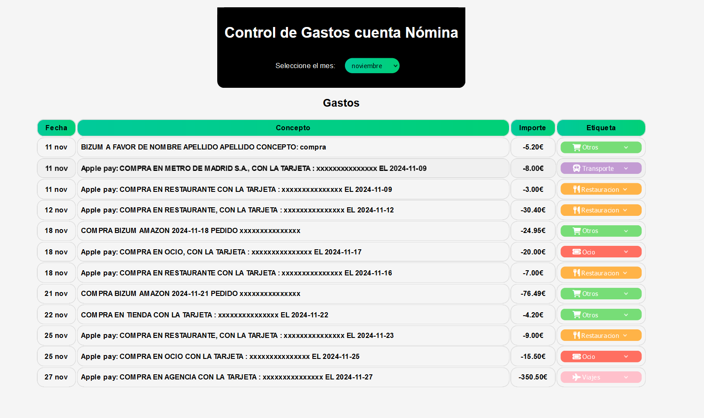
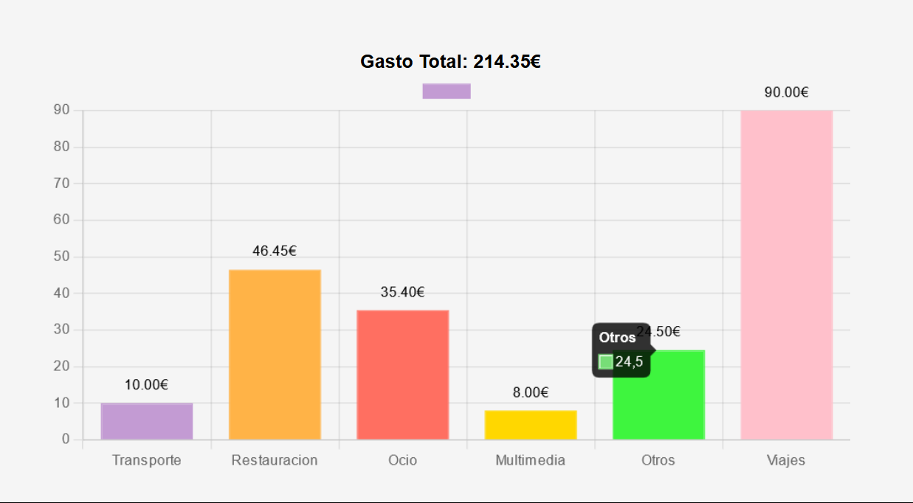

# Banking Application

## Description

This application allows users to manage their banking transactions. Users can upload a file with transaction history, view and filter transactions, and generate statistics. Key features include:

- **Merge Payments**: Users can merge multiple payments into a single entry. For example, if you paid $200 for dinner but received $100 from your friends via Bizum, you can merge these transactions into a single entry showing a net expense of $100. This feature helps to consolidate transactions, making it easier to manage and understand your expenses.

- **Update Tag**: Users can update the tag of a transaction to better categorize their expenses.





## Prerequisites

- Java 11 or higher
- Maven 3.6.3 or higher
- PostgreSQL
- Node.js and npm

## Technologies Used

- Java
- Spring Boot
- PostgreSQL
- Apache POI
- JSON Processing
- Lombok
- Node.js
- npm
- TypeScript

## Installation

1. Clone the repository:
    ```sh
    git clone <REPOSITORY_URL>
    cd <PROJECT_NAME>
    ```

2. Install Node.js dependencies:
    ```sh
    npm install
    ```

3. Install Maven dependencies:
    ```sh
    mvn install
    ```

## Database Configuration

1. Launch a PostgreSQL instance in Docker:
    ```sh
    docker run --name postgres-banking -e POSTGRES_USER=USER -e POSTGRES_PASSWORD=PASS -e POSTGRES_DB=bankingDB -p 8088:5432 -d postgres
    ```

2. Create the required table:
    ```sql
    CREATE TABLE movimientos (
        id SERIAL PRIMARY KEY,
        fecha_operacion DATE NOT NULL,
        importe NUMERIC(10, 2) NOT NULL,
        saldo NUMERIC(10, 2) NOT NULL,
        concepto VARCHAR(255),
        etiqueta VARCHAR(255),
        original VARCHAR(255)
    );
    ```

## Running the Application

1. Start the Spring Boot application:
    ```sh
   java -jar .\target\BankManagementApp-1.0.0.jar
    ```

2. Start the Node.js application:
    ```sh
    node .\src\main\client\index.js
    ```

The application will be available at `http://localhost:3000/`.

**IMPORTANT**

- It is **necessary** to upload a file with the name **"movimientos.xlsx"** to a folder named **transactionshistory** in the root of the project. The file must have the following columns: **fecha_operacion, importe, saldo, concepto, etiqueta, original**. The file must have at least one row of data.

- Also, don´t forget to include the settings for the database connection in the **application.properties** file.